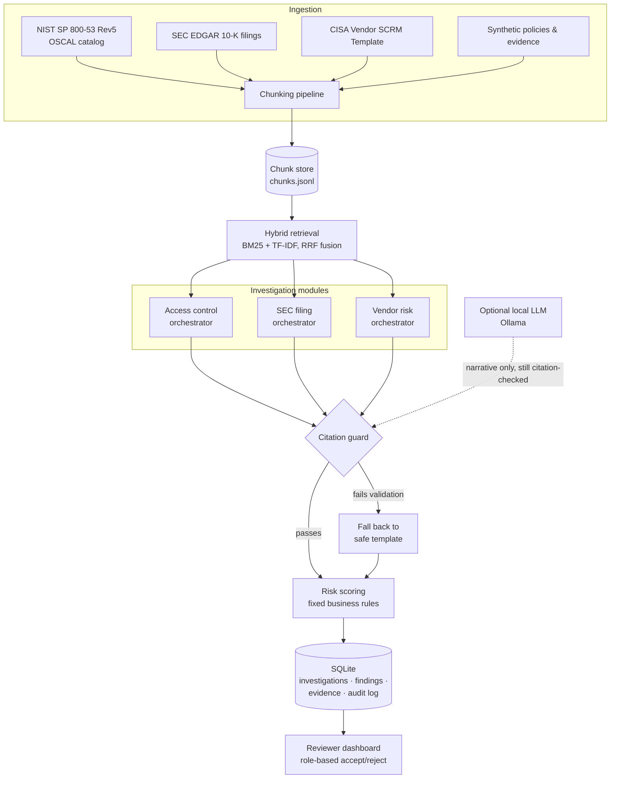

# Financial Compliance Investigation Copilot

**An evidence-grounded and decision-support copilot for compliance and audit investigations.**

I built this to explore a question I keep running into in AI/ML engineering: how do you build an LLM-adjacent system for a high-stakes domain of compliance, audit, risk where a hallucinated finding isn't a minor bug but a real liability. My answer here is architectural, not a prompting trick. Retrieval is separated from generation, every finding is checked against a real citation store before it's ever shown, and the system is designed to say *"insufficient evidence found"* rather than guess. A local LLM is a pluggable, optional layer on top of that - never a dependency for the safety story.

Every dataset is either a real, live-fetched public source (NIST, SEC EDGAR, CISA) or clearly labeled synthetic data with disclosed provenance.

[](https://www.python.org/)
[](LICENSE)
[](backend/tests)
[](https://github.com/TanishkaDighe29/Financial-Compliance-Investigation-Copilot/actions/workflows/ci.yml)

----

## What it does

Three investigation modules share one retrieval index, one citation-validation layer, one risk-scoring formula, and one SQLite-backed reviewer workflow:

| Module | Question it answers | Evidence source |
|---|---|---|
| **Access control** | "Was the Q3 2025 privileged-access review completed and approved for CoreBanking?" | Synthetic company policies + evidence, mapped to real **NIST SP 800-53 Rev5** controls |
| **SEC filing risk** | "Does CRWD's most recent 10-K disclose any material cybersecurity incidents?" | Real facts extracted from **live-fetched SEC EDGAR 10-Ks** |
| **Vendor risk (SCRM)** | "What SCRM gaps exist for vendor redbridge_data?" | Real questions from the **CISA Vendor SCRM Template**, synthetic vendor answers |

A finding always looks like this — grounded, scored, and traceable:

```json
{
  "control_id": "AC-6",
  "evidence_status": "partial",
  "risk_level": "medium",
  "risk_score": 61.2,
  "finding": "Partial evidence was found, but it does not fully satisfy the policy requirement (e.g. missing approval).",
  "supporting_evidence": [
    { "document_name": "access_control_policy.md", "chunk_id": "access_control_policy_004", "quote": "..." },
    { "document_name": "evidence/q3_privileged_access_review.csv", "chunk_id": "q3_privileged_access_review_0000", "quote": "..." }
  ],
  "requires_human_review": true
}
```

If a question is out of scope or the evidence doesn't support a claim, the system reports `"evidence_status": "insufficient"` with zero fabricated citations — see [Evaluation results](#evaluation-results) for exactly how well that abstention behavior currently holds up, including where it doesn't.

---

## Architecture



The one rule that holds everywhere: **generation never bypasses the citation guard.** Whether a finding's narrative comes from a rule-based template or an optional local LLM, it's checked against the real chunk store before it reaches a reviewer — see `backend/app/copilot/citation_guard.py`.

---

## Tech stack

- **API:** FastAPI + Pydantic
- **Retrieval:** BM25 (`rank-bm25`) + TF-IDF cosine (scikit-learn), fused by reciprocal-rank fusion — a from-scratch hybrid search, not a vector-DB wrapper
- **Persistence:** SQLite + SQLAlchemy
- **Parsing:** BeautifulSoup for real SEC 10-K HTML
- **Local LLM (optional):** [Ollama](https://ollama.com), pluggable behind a citation-guarded interface
- **Frontend:** a single static HTML/CSS/JS file — no build step, no framework, no npm
- **Testing:** pytest (20 tests) + a custom evaluation-benchmark runner
- **Ops:** Docker, Docker Compose, GitHub Actions CI

---

## Quickstart

```bash
git clone <this-repo>
cd financial-compliance-copilot
python3 -m venv .venv && source .venv/bin/activate   # optional but recommended
pip install -r requirements.txt

python3 scripts/import_nist_controls.py          # build the real NIST controls subset
python3 scripts/generate_synthetic_evidence.py    # generate synthetic access-control evidence
python3 scripts/generate_vendor_responses.py      # generate synthetic vendor SCRM responses
python3 backend/app/ingestion/parsers.py          # build the retrieval chunk index

uvicorn backend.app.main:app --reload --port 8000
```

> **If `pip install` fails with an "externally-managed-environment" error:** this happens on some
> Debian/Ubuntu systems where the system Python blocks global installs (PEP 668). The `venv` step
> above avoids it entirely — I hit this myself while re-verifying these exact steps and confirmed
> a plain `python3 -m venv .venv` sidesteps it cleanly.

Then open **http://localhost:8000/ui** for the reviewer dashboard, or hit the API directly:

```bash
curl -X POST localhost:8000/investigations -H "X-User-Id: analyst1" -H "Content-Type: application/json" \
  -d '{"question": "Was the Q3 2025 privileged-access review completed and approved for CoreBanking?"}'
```

**Dashboard features:** all three investigation modules are creatable directly from the UI (tabbed
form in the left panel — Access Control / SEC Filing / Vendor Risk, each hitting its real endpoint),
live stat cards (total findings, high-risk count, pending review, average risk score) computed from
whatever's currently filtered, filtering by status, risk level, and module simultaneously plus free-text
search, a connection-status indicator, a per-finding narrative-source badge (`template` vs `llm`, so you
can see at a glance whether a finding's text came from the citation-safe default or a local model), and
an inline legend explaining evidence-status, risk-level, and narrative-source terminology. Still a single
static HTML file — no build step, no framework, no npm.

### Docker (one command)

```bash
docker compose up --build
# API + dashboard both on http://localhost:8000 (dashboard at /ui)
```

Single container, SQLite persisted in a named volume across restarts. See [`docs/data_governance.md`](docs/data_governance.md) and the Docker notes below for what this does and doesn't guarantee.

### Try all three modules

```bash
# Access control
curl -X POST localhost:8000/investigations -H "X-User-Id: analyst1" -H "Content-Type: application/json" \
  -d '{"question": "Was the Q4 2025 privileged-access review completed?"}'

# SEC filing risk (real CrowdStrike data)
curl -X POST localhost:8000/investigations/sec-filing -H "X-User-Id: analyst1" -H "Content-Type: application/json" \
  -d '{"ticker": "CRWD"}'

# Vendor risk
curl -X POST localhost:8000/investigations/vendor-risk -H "X-User-Id: analyst1" -H "Content-Type: application/json" \
  -d '{"vendor": "redbridge_data"}'
```

### Reviewer workflow

Mock users: `analyst1` (analyst), `reviewer1` (reviewer), `manager1` (compliance manager) — passed via the `X-User-Id` header. Role is enforced server-side: an analyst attempting to review their own finding gets a **403**.

```bash
curl -X POST localhost:8000/findings/<finding_id>/review -H "X-User-Id: reviewer1" -H "Content-Type: application/json" \
  -d '{"decision": "accept", "comment": "Confirmed gap, opening remediation ticket."}'

curl "localhost:8000/audit-log?investigation_id=<investigation_id>" -H "X-User-Id: manager1"
```

### Enabling the local LLM (optional)

By default, finding narratives come from a citation-safe rule-based template — every test in this repo runs on that path. To use a real local LLM instead:

1. Install [Ollama](https://ollama.com) and run `ollama pull llama3.1:8b`.
2. In `backend/app/copilot/llm_client.py`, change `get_llm_client()` to return `OllamaClient()`.
3. Restart the API. Every narrative it generates still passes through `citation_guard.validate_finding()` — if the model invents a citation or a control ID not present in the evidence, the system silently falls back to the template. Check `narrative_source` in the response (`"llm"` vs `"template"` vs `"template-fallback-after-..."`) to see which path was actually used.

---

## Evaluation results

I built a real evaluation runner (`backend/app/evaluation/run_evaluation.py`) rather than relying only on unit tests — it runs 20 benchmark cases from `data/evaluation/benchmark.jsonl` against the live orchestrators and reports pass/fail with reasons:

```bash
python3 -m backend.app.evaluation.run_evaluation --verbose
```

**Current score: 17/20 (85%)** — by module: access_control 7/8, out_of_scope 0/2, prompt_injection 2/2, sec_filing 3/3, vendor_risk 5/5. Full results (with per-case reasons) are written to `data/evaluation/results.json` on every run.

This is a measured score, not a target, and I'd rather show it honestly than round it up. Two gaps I understand and haven't papered over:

1. **Out-of-scope questions don't reliably abstain (0/2).** The RRF-fused relevance score compresses too much for a fixed threshold to cleanly separate "genuinely relevant" from "coincidentally shares vocabulary" — a question about weather at "the data center" scores comparably to a real access-control question, because "data center" happens to appear in the real remote-access policy. This is a ceiling of keyword-based retrieval, not a bug: swapping in real sentence embeddings (the noted next step in `hybrid_search.py`) would very plausibly close this, since it would actually understand that "weather forecast" isn't semantically about access control.
2. **One fact-lookup case fails.** The orchestrator's evidence-status logic is built around "was the periodic review evidence found," not general fact-retrieval across arbitrary evidence types. Fixing this well needs a more general evidence-QA capability, not a quick patch.

The benchmark also **found and drove two real fixes** while I was building the third investigation module — worth reading if you're evaluating how I approach debugging: adding SEC and vendor-risk chunks to the shared corpus quietly diluted the access-control module's retrieval rankings, and my first fix for that (rank the *entire* corpus before filtering) accidentally broke abstention by collapsing relevance scores. Both root causes and the actual fixes are documented inline in `hybrid_search.py` and `orchestrator.py`.

---

## Real data, not fabricated placeholders

| Source | What I did |
|---|---|
| **NIST SP 800-53 Rev5** | Downloaded the official OSCAL catalog directly from `usnistgov/oscal-content` and extracted 22 real controls (verbatim requirement text) across AC/IA/AU/IR/RA/SR/CM families |
| **SEC EDGAR** | Live-fetched CrowdStrike's actual FY2022 and FY2025 10-Ks; extracted real, sourced facts (net loss, headcount, revenue, and the real July 2024 Falcon incident) without reproducing the filing's copyrighted prose |
| **CISA Vendor SCRM Template** | Fetched the actual template PDF (a public-domain U.S. government work) and extracted 15 real questions across 7 categories |
| **Synthetic data** | Clearly labeled fictional companies/vendors with deterministic, seeded generation and disclosed, intentional gaps — see [`docs/data_governance.md`](docs/data_governance.md) |

Full source list with links: [`docs/DATA_SOURCES.md`](docs/DATA_SOURCES.md).

---

## Testing & CI

```bash
python3 -m pytest backend/tests/ -v
```

20 tests covering the full reviewer workflow, citation validation, prompt-injection resistance, and all three investigation modules, plus one intentionally-kept `xfail` documenting a known retrieval limitation rather than hiding it.

`.github/workflows/ci.yml` runs on every push: builds the real data pipeline, runs the test suite (blocking), runs the evaluation benchmark (informational — quality tracking, not a pass/fail gate), and does a real `docker build` + container smoke test.

---

## Project structure

```
backend/app/
  copilot/          # orchestrators (access_control, sec, vendor), citation guard, risk scoring, LLM client
  db/                # SQLAlchemy models, session, repositories
  ingestion/         # chunking pipeline, SEC 10-K parser
  retrieval/         # hybrid BM25 + TF-IDF search
  core/security.py   # mock role-based auth
  main.py            # FastAPI app
backend/tests/        # 20 tests + fixtures
data/
  frameworks/         # real NIST controls, real CISA SCRM questions
  raw/sec_edgar/       # real SEC ticker/CIK data + downloader script
  sample_documents/    # synthetic policies, evidence, vendor responses
  evaluation/          # benchmark + results
frontend/index.html    # reviewer dashboard (zero build step)
docs/                  # data sources & governance
scripts/               # data generation / import scripts
Dockerfile · docker-compose.yml · .github/workflows/ci.yml
```

---

## Roadmap

- [ ] Real sentence embeddings (SentenceTransformers + FAISS) to close the out-of-scope abstention gap
- [ ] General evidence-fact-lookup capability across arbitrary evidence types
- [ ] Broader SEC ticker and CISA question coverage
- [ ] Grow the evaluation benchmark toward 75-150 cases
- [ ] Real OAuth/SSO in place of the mock auth layer

## License

[MIT](LICENSE) — use it, fork it, learn from it.

## Acknowledgments

Built entirely on free, public data: [NIST](https://www.nist.gov/), [SEC EDGAR](https://www.sec.gov/edgar), and [CISA](https://www.cisa.gov/).
